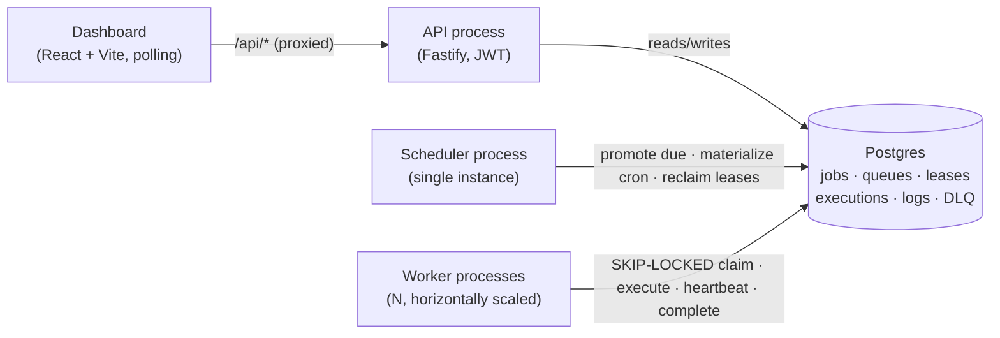
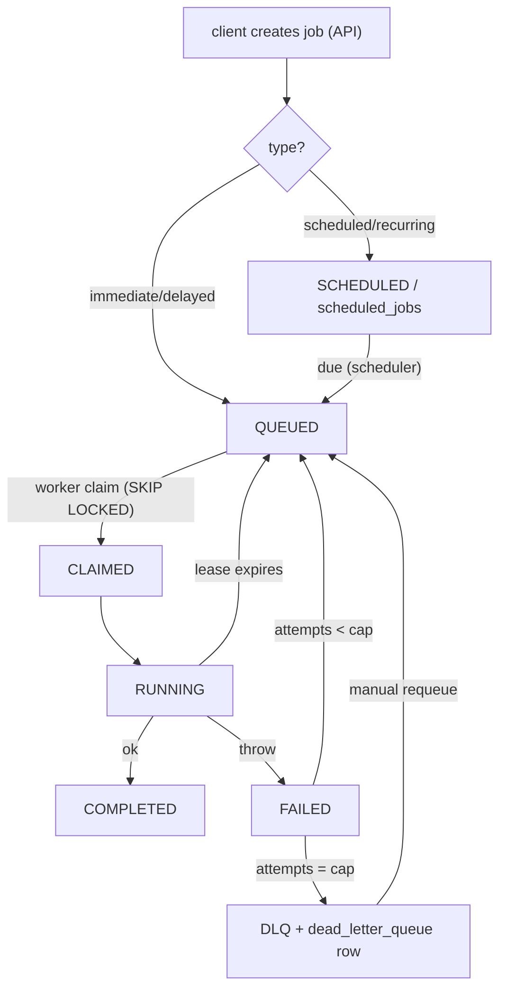
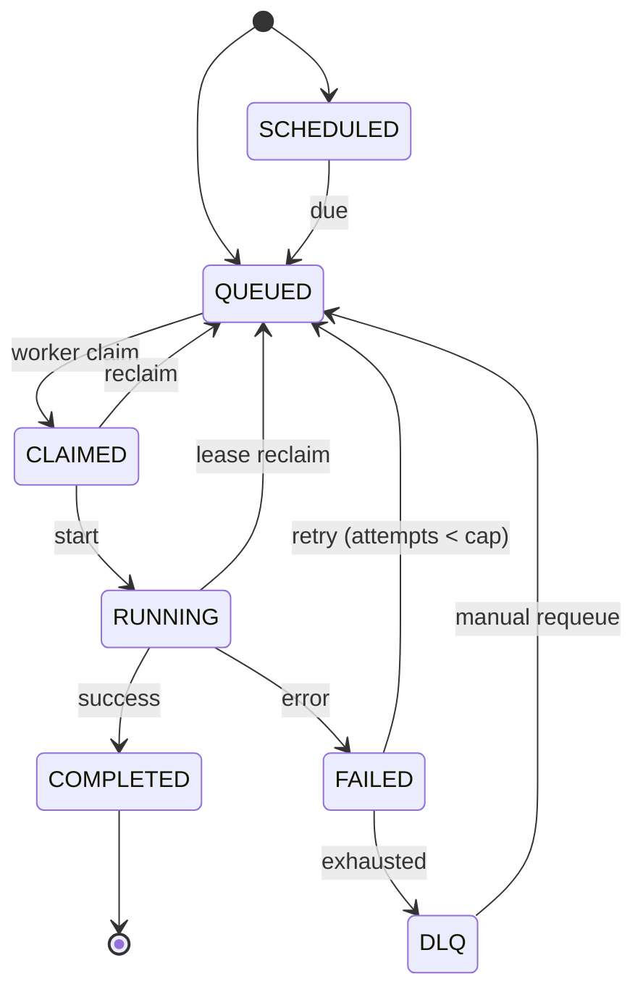

# Architecture

Three stateless process types over one Postgres, which is both the datastore **and** the
coordination substrate (job claiming is a row lock, not a broker message). See
[DECISIONS.md](../DECISIONS.md) §1 for why.

## System diagram



Plain-text fallback:

```
 client ──▶ Dashboard ──▶ API ──┐
                                 ├──▶  Postgres  ◀── Scheduler (promote/cron/reclaim)
                Workers ─────────┘                ◀── Workers  (claim/execute/heartbeat)
```

## Component responsibilities

Each responsibility is a claim checkable against the named file.

| Process | Responsibilities | Code |
|---|---|---|
| **API** | Auth (JWT + scrypt), project/queue/job CRUD, pagination, filtering, validation, error model, request logging, tenant scoping. Owns no scheduling logic. | `src/api.ts`, `src/auth.ts` |
| **Scheduler** | Three idempotent sweeps on a tick: (a) promote `SCHEDULED`/delayed jobs to `QUEUED` when due; (b) materialize the next occurrence of each due cron schedule; (c) reclaim expired leases back to the pool. Single active instance. | `src/scheduler.ts` |
| **Worker** | Poll → atomic claim → mark running → execute (concurrently up to a local limit) → heartbeat (renew lease) → complete, or fail → retry/DLQ. Graceful drain on SIGTERM. | `src/worker.ts`, `src/claim.ts`, `src/retry.ts` |
| **Dashboard** | Read-only operational view over the API: overview, queues, job explorer, workers, job detail, DLQ, throughput. Polling for live updates. | `web/src/**` |

## Data flow (create → run → settle)



## Job lifecycle state machine (enforced in the DB)

The trigger in `db/migrations/002_state_machine.sql` rejects any transition not on an edge below —
even a raw `UPDATE`. This is invariant **I2**.



## Concurrency & reliability invariants

Every invariant has a falsification test that can fail if the logic is wrong (see `test/`).

| # | Invariant | Enforced by | Test |
|---|-----------|-------------|------|
| I1 | A QUEUED job is claimed by at most one worker | `FOR UPDATE SKIP LOCKED` | `claim.test.ts` |
| I2 | Only legal state transitions occur | DB trigger | `state_machine.test.ts` |
| I3 | Only the current lease holder may complete/heartbeat | fencing token | `claim.test.ts` |
| I4 | Retries are bounded; exhaustion → DLQ | attempt cap | `retry.test.ts` |
| I5 | DLQ is terminal and inert | no auto-read; manual requeue only | `retry.test.ts` |
| I7 | Expired leases are reclaimed | scheduler sweep | `claim.test.ts` (via reclaim) |
| I8 | Delayed/scheduled jobs invisible until due | `run_at <= now()` | `jobtypes.test.ts` |
| I9 | Every query is tenant-scoped | `org_id` join | `api.test.ts` |
| I10 | A queue never exceeds its concurrency limit | queue-row lock + fresh count | `claim.test.ts` |
| I11 | A paused queue yields nothing | `status='active'` filter | `claim.test.ts` |

## Observability

- **Structured request logging** via Fastify/pino (correlation id per request) — `src/api-main.ts`.
- **Per-job execution history** in `job_executions` (attempt, worker, timing, error), surfaced in the
  dashboard's job detail.
- **Metrics endpoints**: `/metrics` (job counts + live workers), `/metrics/throughput` (completions
  per minute) — read by the dashboard.
