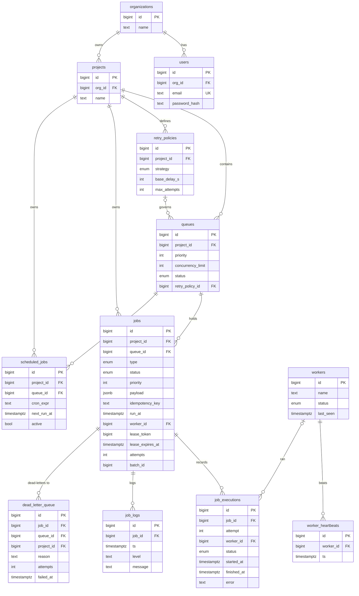

# Database Design

Postgres 17. Full DDL: [`db/migrations/001_init.sql`](../db/migrations/001_init.sql) (schema) and
[`002_state_machine.sql`](../db/migrations/002_state_machine.sql) (the lifecycle trigger).

## ER diagram

## Primary keys  *(D13)*
`bigint GENERATED ALWAYS AS IDENTITY` on every table. Chosen over UUID because the hot append tables
(`jobs`, `job_executions`, `job_logs`, `worker_heartbeats`) need a dense B-tree on the claim index;
random UUIDs fragment it and inflate every foreign key. Externally-meaningful values are separate
columns (e.g. `jobs.idempotency_key`), never the PK.

## Foreign keys & cascades  *(D14 / D17)*
Ownership cascades: `organizations → {users, projects}`, `projects → {queues, retry_policies, jobs,
scheduled_jobs, dead_letter_queue}`, `queues → jobs`, `jobs → {job_executions, job_logs,
dead_letter_queue}` are all `ON DELETE CASCADE` — deleting a tenant/project removes its data cleanly.
Worker references (`jobs.worker_id`, `job_executions.worker_id`) are `ON DELETE SET NULL`, and
`queues.retry_policy_id` is `SET NULL`: deleting a worker or a policy must never destroy job history.

## Indexes  *(D15)*
Every index maps to a named access path; none are speculative.

| Index | Columns | Serves |
|---|---|---|
| `jobs_claim_idx` | `(queue_id, status, priority DESC, run_at)` | **the claim hot path** (I1/I8) — find the next due, highest-priority QUEUED job |
| `jobs_reclaim_idx` | `(lease_expires_at) WHERE status IN ('CLAIMED','RUNNING')` | partial index for the reclaim sweep (I7) |
| `jobs_project_idx` | `(project_id, status)` | tenant-scoped job lists (I9) + job explorer filtering |
| `jobs_batch_idx` | `(batch_id) WHERE batch_id IS NOT NULL` | batch inspection |
| `job_exec_job_idx` | `(job_id, started_at)` | retry history / execution timeline |
| `job_logs_job_idx` | `(job_id, ts)` | per-job log view |
| `heartbeat_idx` | `(worker_id, ts)` | worker liveness history |
| `scheduled_due_idx` | `(next_run_at) WHERE active` | scheduler's due-schedule scan |
| `dlq_project_idx` | `(project_id, failed_at)` | DLQ browse |

Unique constraints: `users.email`, `queues(project_id, name)`, `jobs(queue_id, idempotency_key)`
(NULLs allowed, so non-idempotent jobs are unconstrained).

## Normalization  *(D16)*
Entity tables are in 3NF — a retry policy is its own table referenced by queues, not copied onto each
job. One deliberate denormalization: the per-job counters `attempts` and `status` live on `jobs` so
the claim path reads a single row instead of aggregating `job_executions` on the hottest query.

## Performance considerations  *(D18)*
- The claim index (`jobs_claim_idx`) is the one index that must stay hot; PK and status-enum choices
  are made to keep it dense.
- Partial indexes (`jobs_reclaim_idx`, `scheduled_due_idx`) index only the small set of rows the
  sweeps actually scan, instead of the whole table.
- The concurrency-limit check serializes claims **per queue** (the queue-row `FOR UPDATE`); this is
  the deliberate cost of a correct per-queue limit — different queues never contend. See
  [DECISIONS.md](../DECISIONS.md) §2, §10.
- `worker_heartbeats` is append-only; liveness reads `workers.last_seen` (stamped per beat) so the
  history table stays prunable (24h retention in the reclaim sweep) rather than being on a hot path.
